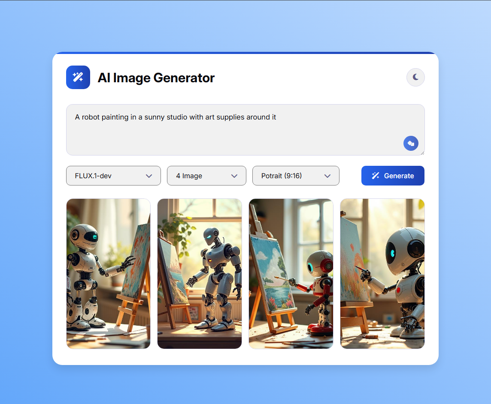

# 🎨 AI Image Generator

A responsive project that generates images from AI models (via API), with a
polished UI, Light/Dark theme, download feature, error & loading handling, and
usage of modern CSS selectors (`:is()`, `:not()`, `:where()`) for maintainable
styles. Built to practice clean JavaScript, accessible UI, and client-side image
handling (using `Response.blob()`).\*\*.

---

---

## 📸 Screenshots

## Key Features

- Generate images using an external AI inference API (e.g., Hugging Face /
  Replicate / custom provider)
- Responsive, accessible UI — mobile first
- Light / Dark theme support with saved preference (localStorage + system
  preference)
- Clean, modular JavaScript code and well-structured functions
- Modern CSS techniques: `:is()`, `:not()`, `:where()` usage for readable
  selectors
- Loading spinner and graceful error UI
- Save image results to local history (localStorage)
- Download generated images (using `Response.blob()` -> `URL.createObjectURL()`)
- Progressive enhancement and basic accessibility

---

## Tech Stack

- HTML5
- CSS3 (modern selectors)
- JavaScript (ES6+)
- Optional: Any static server (e.g., `live-server`, `http-server`) for testing

---

## ⚡ Live :

- https://ashikurahman1.github.io/ai-image-generator/
